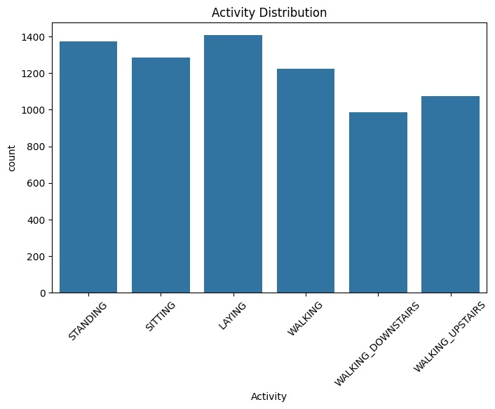
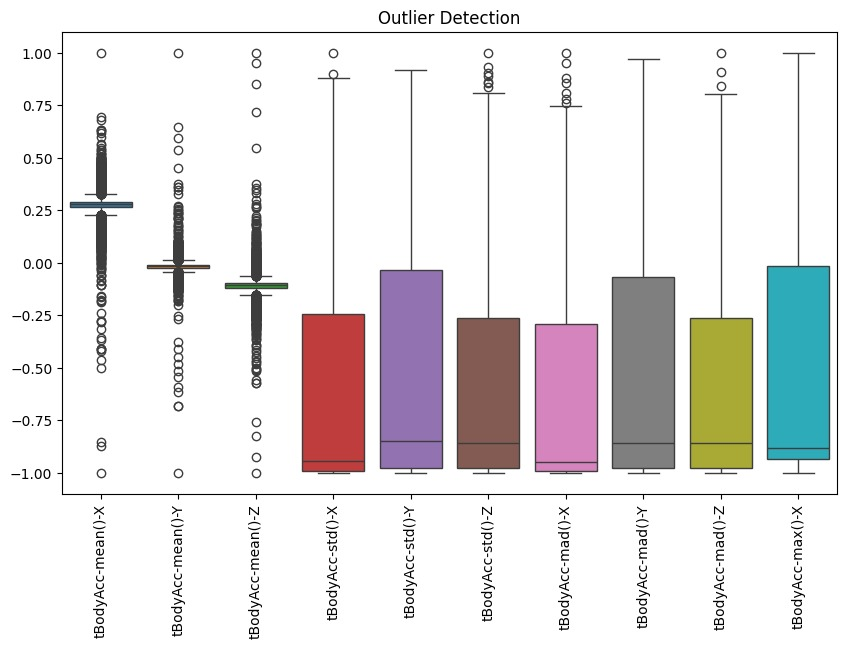
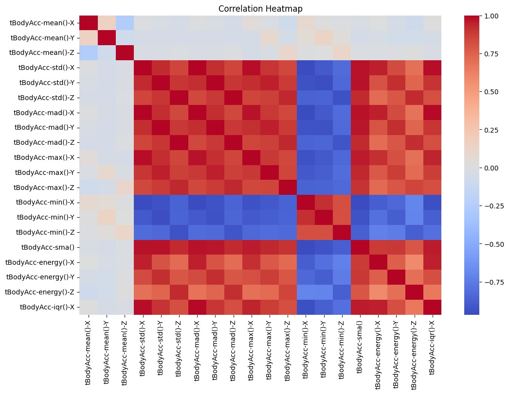
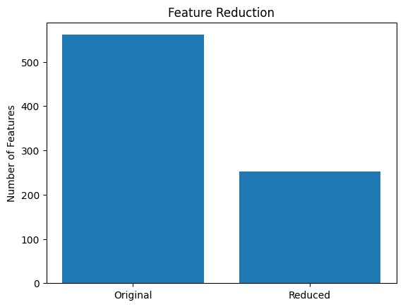
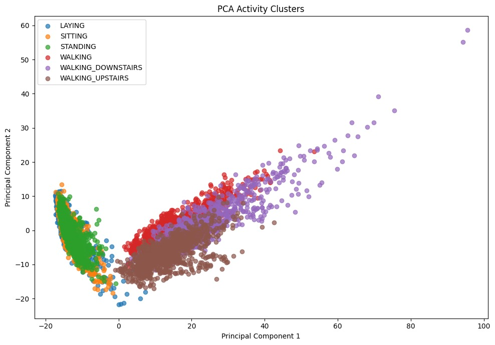
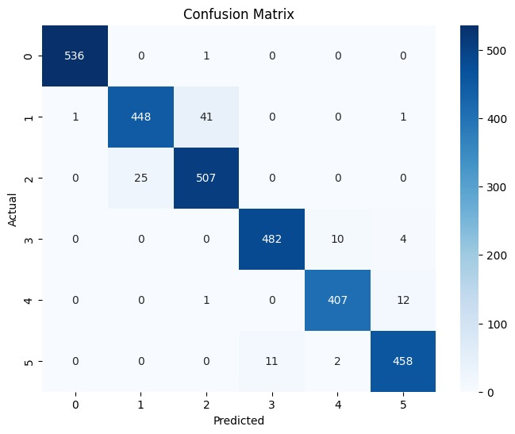

<h1 align="center">Human Activity Recognition using Logistic Regression</h1>

<h2>Project Overview</h2>

This project focuses on recognizing human activities using smartphone sensor data and Machine Learning techniques. The model is trained using the Human Activity Recognition (HAR) dataset and implemented using Logistic Regression.

The objective of this project is to automatically classify daily human activities based on accelerometer and gyroscope sensor measurements collected from smartphones.

<h2>Problem Statement</h2>

Human Activity Recognition (HAR) is an important application of Machine Learning in healthcare, fitness tracking, smart homes, and wearable technology. Manual observation of activities is inefficient and impractical for real-time monitoring.

This project builds a classification model that predicts:

<ul>
<li>Walking</li>
<li>Walking Upstairs</li>
<li>Walking Downstairs</li>
<li>Sitting</li>
<li>Standing</li>
<li>Laying</li>
</ul>

using sensor data collected from smartphones.

<h2>Dataset Information</h2>

Dataset Used:

Human Activity Recognition Using Smartphones Dataset

Source: Kaggle / UCI Machine Learning Repository
<h3>Dataset Link</h3>

<a href="https://www.kaggle.com/datasets/uciml/human-activity-recognition-with-smartphones"
target="_blank">
Click Here to Open Dataset
</a>

<h3>Dataset Details</h3>

<ul>
<li>Total Records: 10,299</li>
<li>Training Records: 7,352</li>
<li>Testing Records: 2,947</li>
<li>Total Features: 561</li>
<li>Activities: 6</li>
<li>Participants: 30</li>
<li>Missing Values: None</li>
</ul>

<h3>Activities Included</h3>

<ul>
<li>Walking</li>
<li>Walking Upstairs</li>
<li>Walking Downstairs</li>
<li>Sitting</li>
<li>Standing</li>
<li>Laying</li>
</ul>

<h3>Sensor Information</h3>

The dataset contains measurements obtained from smartphone sensors:

<ul>
<li>3-Axis Accelerometer</li>
<li>3-Axis Gyroscope</li>
<li>Body Acceleration Signals</li>
<li>Angular Velocity Signals</li>
<li>Time Domain Features</li>
<li>Frequency Domain Features</li>
</ul>

<h2>Technologies Used</h2>

<ul>
<li>Python</li>
<li>Pandas</li>
<li>NumPy</li>
<li>Matplotlib</li>
<li>Seaborn</li>
<li>SciPy</li>
<li>Scikit-Learn</li>
<li>Jupyter Notebook</li>
</ul>

<h2>Machine Learning Algorithm</h2>

<h3>Logistic Regression</h3>

Logistic Regression is a supervised machine learning algorithm used for classification problems.

The model learns patterns from smartphone sensor measurements and predicts the activity being performed.

Activity labels were encoded as:

<ul>
<li>0 = Laying</li>
<li>1 = Sitting</li>
<li>2 = Standing</li>
<li>3 = Walking</li>
<li>4 = Walking Downstairs</li>
<li>5 = Walking Upstairs</li>
</ul>

<h2>Project Workflow</h2>

<ol>
<li>Import Libraries</li>
<li>Load Dataset</li>
<li>Data Cleaning</li>
<li>Missing Value Analysis</li>
<li>Duplicate Detection</li>
<li>Outlier Analysis</li>
<li>Exploratory Data Analysis</li>
<li>Correlation Analysis</li>
<li>Feature Reduction</li>
<li>Statistical Analysis</li>
<li>Label Encoding</li>
<li>Feature Scaling</li>
<li>Principal Component Analysis (PCA)</li>
<li>Model Training using Logistic Regression</li>
<li>Prediction</li>
<li>Model Evaluation</li>
<li>Data Visualization</li>
</ol>

<h2>Data Preprocessing</h2>

<h3>Missing Value Analysis</h3>

<ul>
<li>No missing values were found in the dataset.</li>
</ul>

<h3>Duplicate Detection</h3>

<ul>
<li>No duplicate records were found.</li>
</ul>

<h3>Outlier Detection</h3>

<ul>
<li>Boxplots were used to visualize potential outliers.</li>
<li>Outliers were retained because sensor measurements naturally contain extreme values.</li>
</ul>

<h3>Correlation-Based Feature Reduction</h3>

<ul>
<li>Original Features: 561</li>
<li>Reduced Features: 253</li>
<li>Removed Features: 308</li>
</ul>

Features with correlation greater than 0.95 were removed to reduce redundancy and improve model efficiency.

<h3>Feature Scaling</h3>

Standardization was applied using:

<pre>
StandardScaler()
</pre>

<h2>Statistical Analysis</h2>

<h3>Confidence Interval</h3>

<pre>
95% Confidence Interval:
(0.2729, 0.2761)
</pre>

This interval estimates the range in which the true population mean is expected to lie with 95% confidence.

<h3>ANOVA Test</h3>

<pre>
F Statistic = 17.6269
P Value = 2.11 × 10⁻¹⁷
</pre>

The extremely small p-value indicates statistically significant differences among activity groups.

<h2>Data Visualizations</h2>

<ul>
<li>Activity Distribution Plot</li>
  
<li>Outlier Detection Box Plot</li>
  
<li>Correlation Heatmap</li>
  
<li>Feature Reduction Comparison Chart</li>
  
<li>PCA Activity Clusters</li>
  
<li>Confusion Matrix Heatmap</li>
  
</ul>

These visualisations help understand activity distribution, feature relationships, dimensionality reduction, and model performance.

<h2>Principal Component Analysis (PCA)</h2>

PCA was used to reduce the 561-dimensional feature space into 2 principal components for visualisation purposes.

The PCA cluster plot shows distinct activity groups, indicating that smartphone sensor features effectively differentiate between various human activities.

<h2>Model Performance</h2>

<h3>Model Accuracy: 96.30%</h3>

<table border="1" cellpadding="10">

<tr>
<th>Metric</th>
<th>Value</th>
</tr>

<tr>
<td>Accuracy</td>
<td>96.30%</td>
</tr>

<tr>
<td>Precision</td>
<td>96%</td>
</tr>

<tr>
<td>Recall</td>
<td>96%</td>
</tr>

<tr>
<td>F1-Score</td>
<td>96%</td>
</tr>

<tr>
<td>MSE</td>
<td>0.0594</td>
</tr>

<tr>
<td>RMSE</td>
<td>0.2437</td>
</tr>

<tr>
<td>R² Score</td>
<td>0.9796</td>
</tr>

</table>

<h2>Confusion Matrix</h2>

The confusion matrix visualizes actual versus predicted activities and demonstrates excellent classification performance across all activity categories.

<h2>Installation</h2>

<pre>
pip install pandas numpy matplotlib seaborn scipy scikit-learn
</pre>

<h2>How to Run</h2>

<ol>
<li>Extract Dataset.zip</li>
<li>Open HumanActivityRecognition.ipynb</li>
<li>Run all notebook cells</li>
<li>Train the Logistic Regression model</li>
<li>View evaluation metrics and visualizations</li>
</ol>

<h2>Project Structure</h2>

<pre>
  HumanActivityRecognition/
│
├── Dataset.zip
│   ├── train.csv
│   └── test.csv
│
├── images/
│   ├── ActivityDistributionPlot.jpeg
│   ├── ConfusionMatrixHeatmap.jpeg
│   ├── CorrelationHeatmap.jpeg
│   ├── DetectionBoxPlot.jpeg
│   ├── FeatureReductionComparisonChart.jpeg
│   └── PCAActivityClusters.jpeg
│
├── HumanActivityRecognition.ipynb
│
└── README.md
</pre>

<h2>Applications</h2>

<ul>
<li>Fitness Tracking Systems</li>
<li>Healthcare Monitoring</li>
<li>Elderly Care Solutions</li>
<li>Smart Homes</li>
<li>Wearable Devices</li>
<li>Sports Performance Analysis</li>
<li>Activity-Aware Mobile Applications</li>
</ul>

<h2>Key Learnings</h2>

<ul>
<li>Data Cleaning and Preprocessing</li>
<li>Feature Scaling</li>
<li>Correlation-Based Feature Selection</li>
<li>Statistical Analysis using ANOVA</li>
<li>Principal Component Analysis (PCA)</li>
<li>Logistic Regression Classification</li>
<li>Confusion Matrix Interpretation</li>
<li>Model Evaluation Metrics</li>
<li>Data Visualization Techniques</li>
</ul>

<h2>Future Improvements</h2>

<ul>
<li>Hyperparameter Tuning</li>
<li>Cross Validation</li>
<li>Random Forest Classification</li>
<li>Support Vector Machine (SVM)</li>
<li>XGBoost Classification</li>
<li>Deep Learning Models (CNN/LSTM)</li>
<li>Real-Time Activity Recognition System</li>
<li>Deployment using Streamlit or Flask</li>
</ul>

<h2>Conclusion</h2>

This project successfully demonstrates the use of Logistic Regression for Human Activity Recognition using smartphone sensor data. After preprocessing, feature reduction, PCA visualization, and statistical analysis, the model achieved an accuracy of 96.30%. The results highlight the effectiveness of machine learning in recognizing human activities and its potential applications in healthcare, fitness tracking, smart environments, and wearable technology.

